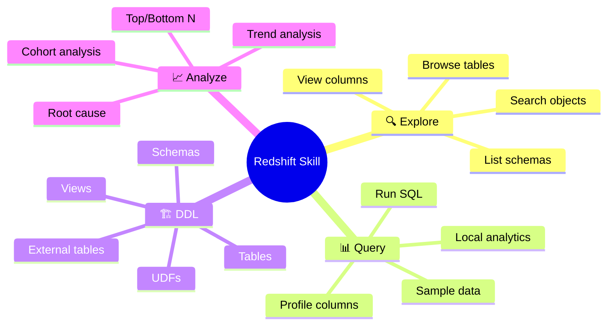
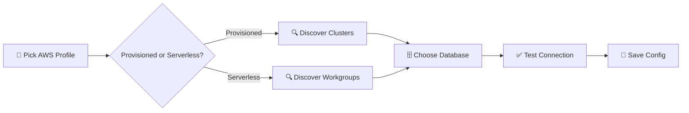
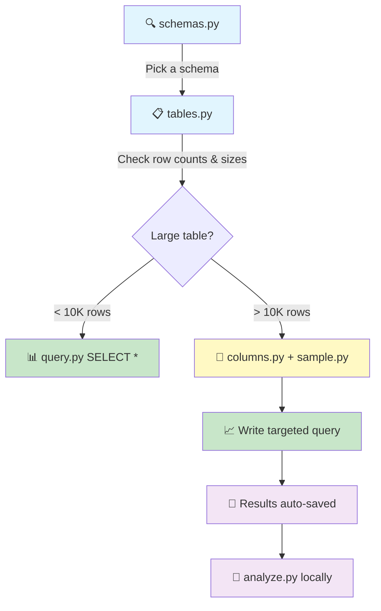
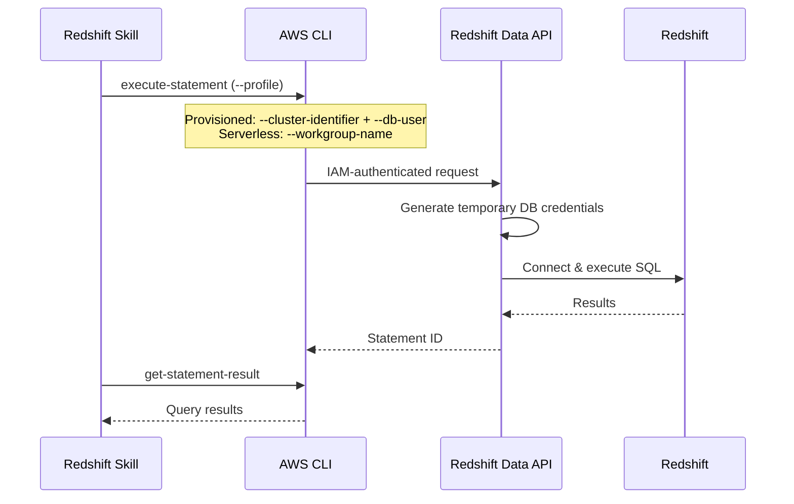

# 🔴 Redshift Skill

> **Your AI-powered data analyst for AWS Redshift.** Explore schemas, run queries, generate DDL, profile data — all read-only, all cross-platform, zero pip install. Works with both **provisioned clusters** and **Redshift Serverless**.

Works with **any AI coding agent** — Claude Code, Cursor, Codex, and more.

```
🛡️ Read-only     🖥️ Mac + Windows     📦 Zero dependencies     🔌 Any AI agent
```

## 📑 Table of Contents

- [✨ What can it do?](#-what-can-it-do)
- [🚀 Quick Start](#-quick-start)
- [📖 Scripts](#-scripts)
  - [🔍 Exploration](#-exploration)
  - [📊 Querying & Analysis](#-querying--analysis)
  - [🏗️ DDL Generation](#️-ddl-generation)
  - [📏 Metadata & Storage](#-metadata--storage)
- [🔄 Recommended Workflow](#-recommended-workflow)
- [📈 Business Analysis Patterns](#-business-analysis-patterns)
- [🛡️ Safety](#️-safety)
- [📂 Output & File Saving](#-output--file-saving)
- [⚙️ Configuration](#️-configuration)
- [🧰 Prerequisites](#-prerequisites)
- [🔐 Security & Connection](#-security--connection)
- [📜 License](#-license)

## ✨ What can it do?



## 🚀 Quick Start

### 1. Install

```bash
npx skills add onsen-ai/redshift-skill
```

Or install globally:

```bash
npx skills add onsen-ai/redshift-skill -g
```

> See [vercel-labs/skills](https://github.com/vercel-labs/skills) for more install options.

### 2. Setup

Run the interactive wizard in your terminal:

```bash
python3 scripts/setup.py    # macOS / Linux
python scripts/setup.py     # Windows
```

The wizard walks you through:



Config is saved to `~/.redshift-skill/config.json` — re-run anytime to change settings.

### 3. Go!

```bash
python3 scripts/query.py "SELECT count(1) FROM sales.fact_orders"
```

That's it. All scripts auto-detect your saved connection. 🎉

## 📖 Scripts

### 🔍 Exploration

| Script | What it does | Example |
| ------ | ------------ | ------- |
| `schemas.py` | List all schemas and owners | `schemas.py` |
| `tables.py` | Browse tables with row counts & sizes | `tables.py --schema=sales` |
| `columns.py` | Column types, encoding, dist/sort keys | `columns.py --schema=sales --table=fact_orders` |
| `search.py` | Find tables/columns by name pattern | `search.py --pattern=revenue` |
| `sample.py` | Peek at actual data values | `sample.py --schema=sales --table=dim_products --limit=5` |

### 📊 Querying & Analysis

| Script | What it does | Example |
| ------ | ------------ | ------- |
| `query.py` | Run any read-only SQL | `query.py "SELECT ..."` or `query.py --sql-file=my.sql` |
| `profile.py` | Per-column stats (nulls, cardinality, min/max) | `profile.py --schema=sales --table=dim_customers` |
| `analyze.py` | Local analytics on saved files — **no Redshift needed** | `analyze.py data.csv --describe` |

#### 🧮 analyze.py operations

```bash
analyze.py data.csv --describe                        # Per-column statistics
analyze.py data.csv --sum=revenue                     # Sum a column
analyze.py data.csv --group-by=region --avg=sales     # Group by + aggregate
analyze.py data.csv --filter='year=2024' --top=10     # Filter + top N
analyze.py data.csv --hist=price                      # Text histogram
```

### 🏗️ DDL Generation

Generate `CREATE` statements for **7 object types** — full DDL with distkeys, sortkeys, encoding, constraints, and ownership:

| Type | Example |
| ---- | ------- |
| 📋 Table | `ddl.py --schema=sales --name=fact_orders` |
| 👁️ View | `ddl.py --type=view --schema=sales --name=v_daily_revenue` |
| 📁 Schema | `ddl.py --type=schema --name=sales` |
| 🗄️ Database | `ddl.py --type=database` |
| ⚙️ UDF | `ddl.py --type=udf --schema=public` |
| 🌐 External | `ddl.py --type=external --schema=spectrum` |
| 👥 Group | `ddl.py --type=group` |

### 📏 Metadata & Storage

| Script | What it does | Example |
| ------ | ------------ | ------- |
| `table_info.py` | Size, rows, skew, encoding, sort key stats | `table_info.py --schema=sales --table=fact_orders` |
| `space.py` | Largest tables by disk usage | `space.py --schema=sales --top=10` |

## 🔄 Recommended Workflow



> 💡 **Don't follow this rigidly!** If the user knows exactly what they want, skip straight to the query. This is a guide for unfamiliar schemas, not a mandatory checklist.

## 📈 Business Analysis Patterns

The skill is built for real-world analyst work — product analysts, commercial analysts, BI developers.

| Pattern | Approach |
| ------- | -------- |
| 📊 **Trend analysis** | `GROUP BY month` + `SUM`/`COUNT`, compare YoY/MoM |
| 👥 **Cohort analysis** | Group by first purchase date, track retention |
| 📉 **Root cause** | Decompose metric → slice by dimensions → drill into outliers |
| 🏆 **Top/Bottom N** | `ORDER BY metric DESC LIMIT N` |
| 📅 **YoY comparison** | Self-join shifted by 1 year, or `LAG()` window function |
| 🔢 **Distribution** | `NTILE(100)`, percentiles, or `analyze.py --hist` locally |
| 🎯 **Pareto (80/20)** | Cumulative `SUM() OVER (ORDER BY ...)` |
| 🧩 **Segmentation** | `CASE WHEN` or `NTILE` to bucket, then profile each segment |

## 🛡️ Safety

### Read-only guardrails

Two layers of protection — the AI agent validates SQL before sending, and the script itself **hard-blocks** anything that isn't read-only:

```
✅ Allowed:  SELECT · WITH · SHOW · DESCRIBE · EXPLAIN · SET
❌ Blocked:  CREATE · ALTER · DROP · INSERT · UPDATE · DELETE · MERGE · COPY · UNLOAD · GRANT · REVOKE
```

Multi-statement queries (`;` followed by another statement) are also blocked.

### Defensive query rules

| Table size | Approach |
| ---------- | -------- |
| < 10K rows | Explore freely, `SELECT *` is fine |
| 10K – 1M rows | Add `WHERE` or `LIMIT` |
| > 1M rows | Always aggregate or filter, never `SELECT *` |

## 📂 Output & File Saving

All results are **automatically saved** to `~/redshift-exports/`:

- 📄 First 20 rows shown inline (quick preview)
- 💾 Full results saved to file (for follow-up with `analyze.py`)
- 📍 File path printed so the agent can read it for deeper analysis

```bash
--format=txt|csv|json    # Output format (default: txt)
--save=PATH              # Save to specific location
--no-save                # Skip auto-save
```

## ⚙️ Configuration

**Provisioned cluster:**

```json
// ~/.redshift-skill/config.json
{
  "profile": "my-profile",
  "cluster": "my-cluster",
  "database": "my-database",
  "db_user": "admin",
  "region": "us-east-1"
}
```

**Serverless workgroup:**

```json
// ~/.redshift-skill/config.json
{
  "profile": "my-profile",
  "workgroup": "my-workgroup",
  "database": "my-database",
  "region": "us-east-1"
}
```

> Serverless doesn't need `db_user` — the Data API authenticates as your IAM identity directly.

Edit directly or re-run `python3 scripts/setup.py`.

## 🧰 Prerequisites

- **Python 3.8+** — stdlib only, no pip packages needed
- **AWS CLI v2** — with a profile that has [Redshift Data API](https://docs.aws.amazon.com/redshift/latest/mgmt/data-api.html) access
- **Redshift Data API access** — no explicit enable toggle needed, but your cluster's security group must allow inbound connections from the Data API service. For provisioned clusters, the `--db-user` must already exist in the database. For serverless, your IAM identity is used directly.

> 💡 On macOS use `python3`, on Windows use `python`. The setup wizard saves your Python path so the agent uses the right one automatically.

## 🔐 Security & Connection

### No secrets, no credentials in config

The skill connects to Redshift entirely through **IAM** — your AWS CLI profile handles authentication. No database passwords, access keys, or secrets are stored anywhere. The config file (`~/.redshift-skill/config.json`) contains only connection metadata (cluster name, database, region), never credentials.

### How it works



The [Redshift Data API](https://docs.aws.amazon.com/redshift/latest/mgmt/data-api.html) generates temporary database credentials internally — you never call `GetClusterCredentials` or manage tokens yourself.

### Required IAM permissions

The AWS CLI profile used by the skill needs the following permissions:

**Provisioned clusters:**

```json
{
  "Version": "2012-10-17",
  "Statement": [
    {
      "Effect": "Allow",
      "Action": [
        "redshift-data:ExecuteStatement",
        "redshift-data:DescribeStatement",
        "redshift-data:GetStatementResult"
      ],
      "Resource": "*"
    },
    {
      "Effect": "Allow",
      "Action": "redshift:DescribeClusters",
      "Resource": "*"
    }
  ]
}
```

**Serverless workgroups:**

```json
{
  "Version": "2012-10-17",
  "Statement": [
    {
      "Effect": "Allow",
      "Action": [
        "redshift-data:ExecuteStatement",
        "redshift-data:DescribeStatement",
        "redshift-data:GetStatementResult"
      ],
      "Resource": "*"
    },
    {
      "Effect": "Allow",
      "Action": "redshift-serverless:ListWorkgroups",
      "Resource": "*"
    }
  ]
}
```

| Permission | Mode | Purpose |
| ---------- | ---- | ------- |
| `redshift-data:ExecuteStatement` | Both | Submit SQL queries |
| `redshift-data:DescribeStatement` | Both | Poll query execution status |
| `redshift-data:GetStatementResult` | Both | Fetch paginated results |
| `redshift:DescribeClusters` | Provisioned | Discover clusters during setup |
| `redshift-serverless:ListWorkgroups` | Serverless | Discover workgroups during setup |

### Restricting database user impersonation (provisioned only)

With provisioned clusters, the `--db-user` parameter allows the IAM principal to connect as any database user. To restrict this, scope your IAM policy with a condition:

```json
{
  "Effect": "Allow",
  "Action": "redshift-data:ExecuteStatement",
  "Resource": "arn:aws:redshift:<region>:<account>:cluster:<cluster-id>",
  "Condition": {
    "StringEquals": {
      "redshift:DbUser": ["analyst_readonly"]
    }
  }
}
```

> Serverless doesn't use `--db-user` — it authenticates as your IAM identity directly, so this condition doesn't apply.

💡 For defense in depth, combine IAM restrictions with a read-only database user — the skill's application-level SQL validation is the first layer, IAM is the second, and database grants are the third.

## Built by

Built by the team at [Onsen](https://www.onsenapp.com) — an AI-powered mental health companion for journaling, emotional wellbeing, and personal growth.

## 📜 License

MIT — see [LICENSE](LICENSE).

SQL in `scripts/sql/` is derived from [amazon-redshift-utils](https://github.com/awslabs/amazon-redshift-utils) (Apache 2.0).
